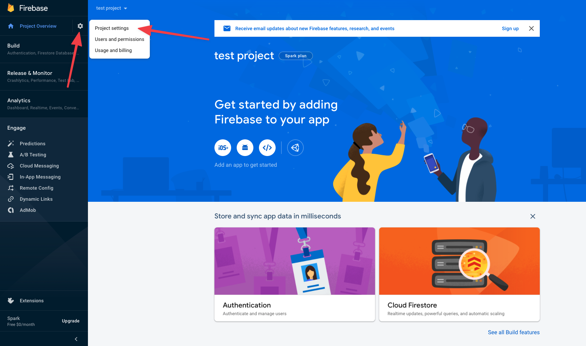
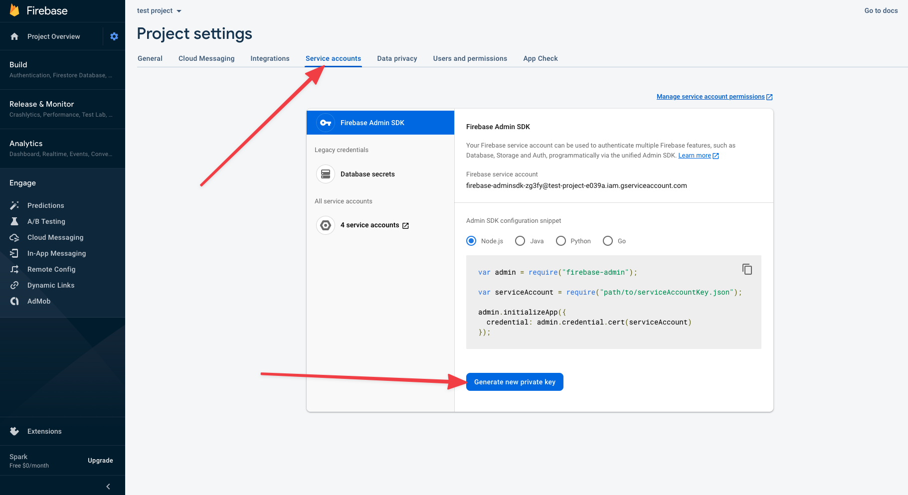

# Firebase Cloud Messaging Delivery Method

Send Android Device Notifications using the Google Firebase Cloud Messaging service and the `googleauth` gem.

```bash
bundle add "googleauth"
```

## Google Firebase Cloud Messaging Notification Service

To generate your Firebase Cloud Messaging credentials, you'll need to create your project if you have not already. See https://console.firebase.google.com/u/1/
Once you have created your project, visit the project dashboard and click the settings cog in the top of the left sidebar menu, then click project settings.



In the project settings screen click on the Service accounts tab in the top navigation menu, then click the Generate new private key button.



This json file will contain the necessary credentials in order to send notifications via Google Firebase Cloud Messaging.
See the below instructions on where to store this information within your application.

## Usage

```ruby
class CommentNotification
  deliver_by :fcm, credentials: :fcm_credentials, format: :format_notification

  # This needs to return the path to your FCM credentials
  def fcm_credentials
    Rails.root.join("config/certs/fcm.json")
  end

  def format_notification(device_token)
    {
      token: device_token,
      notification: {
        title: "Test Title",
        body: "Test body"
      }
    }
  end
end
```

## Options

* `format: :format_notification`
  Customize the Firebase Cloud Messaging notification object

* `credentials: :fcm_credentials`
The location of your Firebase Cloud Messaging credentials.
- When a String object: `deliver_by :fcm, credentials: "config/credentials/fcm.json"`
  * Interally, this string is passed to `Rails.root.join()` as an argument so there is no need to do this beforehand.
- When a Pathname object: `deliver_by :fcm, credentials: Rails.root.join("config/credentials/fcm.json")`
   * The Pathname object can point to any location where you are storing your credentials.
- When a Hash object: `deliver_by :fcm, credentials: credentials_hash`
    ```ruby
        credentials_hash = {
          "type": "service_account",
          "project_id": "test-project-1234",
          "private_key_id": ...,
          etc.....
        }
    ```

  * A Hash which contains your credentials
- When a Symbol: `deliver_by :fcm, credentials: :fcm_credentials, format: :format_notification`
    ```ruby
        def fcm_credentials
          Rails.root.join("config/certs/fcm.json")
        end
    ```

  * Points to a method which can return a Hash of your credentials, Pathname, or String to your credentials like the examples above.

Otherwise, if the credentials option is left out, it will look for your credentials in: `Rails.application.credentials.fcm`

## Gathering Notification Tokens

A recipient can have multiple tokens (i.e. multiple Android devices), so make sure to return them all.

Here, the recipient `has_many :notification_tokens` with columns `platform` and `token`.

```ruby
def fcm_device_tokens(recipient)
  recipient.notification_tokens.where(platform: "fcm").pluck(:token)
end
```

## Handling Failures

Firebase Cloud Messaging Notifications may fail delivery if the user has removed the app from their device.

```ruby
class CommentNotification
  deliver_by :fcm

  # Remove invalid device tokens
  #
  # token - the device token from iOS or FCM
  # platform - "iOS" or "fcm"
  def cleanup_device_token(token:, platform:)
    NotificationToken.where(token: token, platform: platform).destroy_all
  end
end
```
